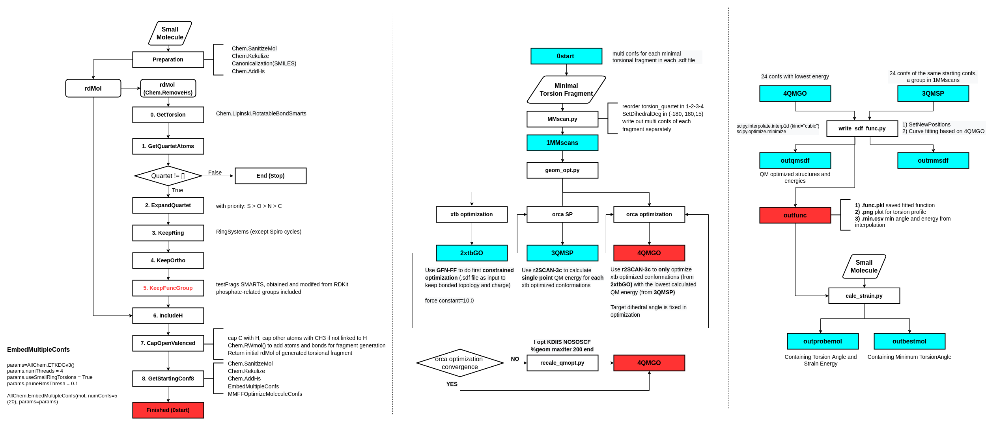

### RDkit for Pfizer's minimal torsion fragment extraction
- One can simply use rdkit_Pfrag.py to generate all minimal torsion fragments, with example output information in `rdkit_Pfrag.ipynb` and initial 3D structures of all fragments in dir `outputs` with .sdf format.
- For a group of generated torsion fragments, `redund_MTF.py` was used to remove redundancy for saving time.
- `MMscan.py` to use RDKit to rotate [-180,180,15], the order of dihedral atoms are also modified for the need here and afterwards.
- Still need more test...
  - Test on AmpC binders and nonbinders200 subset ~~looks well~~ looks better now, while still have some issues needed to think about:
    - Chirality is wrongly added in some cases
    - Capping is a bit counterintuitive (including simply adding H for carbonyl C)
    - The selection of functional groups and the step-by-step operation can be different from OE results

***
- Flowchart

